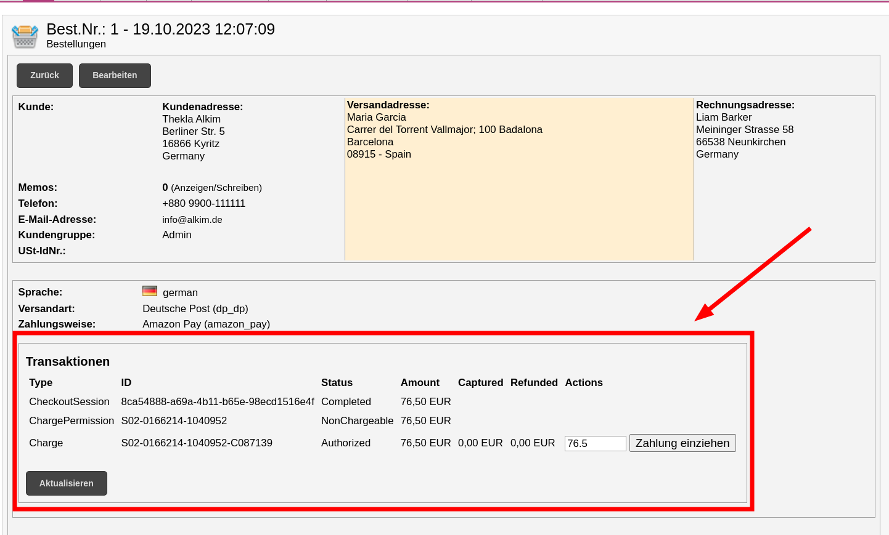
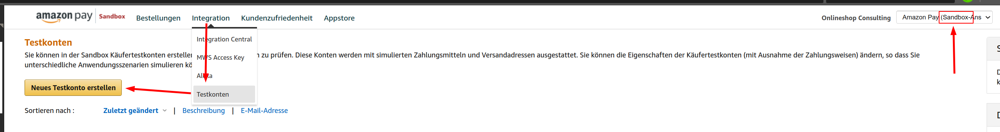

## Über dieses Plugin
Mit Amazon Pay können Ihre Kunden auf Ihrer Website bequem und sicher über ihr Amazon-Konto einkaufen. Diese Checkout-Option ermöglicht es den Nutzern, ihre bestehenden Amazon-Zahlungsmethoden und Lieferadressen in Ihrem modified eCommerce-Shop zu verwenden.

## Voraussetzungen
### Systemanforderungen
* [x] modified eCommerce ab Version 1.0.6 (richtigen Download wählen)
* [x] PHP 5.6+
* [x] Valides SSL-Zertifikat

## Einrichtung eines Amazon Händler-Kontos
### Kontoerstellung
Um Amazon Pay nutzen zu können, ist ein dediziertes Amazon Pay Händler-Konto erforderlich. Dieses muss sich von anderen Amazon-Konten, die Sie verwenden, unterscheiden. Bitte stellen Sie sicher, dass Sie von allen Amazon-Konten abgemeldet sind, bevor Sie den Registrierungsprozess starten.

### Erforderliche Angaben
Sie müssen Ihre Unternehmensdaten für die Registrierung angeben. Diese Informationen müssen exakt mit den Angaben in Ihren offiziellen Dokumenten übereinstimmen. Weitere Details finden Sie unter [Amazon Pay Hilfe](https://pay.amazon.de/help/202153180).

### Anmeldung bei Amazon Pay
Folgen Sie diesen Schritten für die Anmeldung:

1. Besuchen Sie [Amazon Pay Anmeldung](https://pay.amazon.de/signup)
2. Wählen Sie "modified eCommerce" aus dem Dropdown-Menü
3. Folgen Sie den Anweisungen auf dem Bildschirm.

## Installation

!!! tip "Sicherheitsvorkehrungen"
    Ein Backup ist vor jeglichen Änderungen an Ihrem Shop empfehlenswert. Bei Vorhandensein eines Test-Shops sollten Sie dort zuerst installieren.

### Download und Installation
Die aktuelle Version finden Sie in unserem [Download-Bereich](downloads.md). Jedem Download-Paket liegt eine umfangreiche Installationsanleitung bei.

### Admin-Bereich Installation
1. Loggen Sie sich in den Admin-Bereich ein
2. Navigieren Sie zu `Module → Zahlungsoptionen` und klicken Sie auf `Amazon Pay` unter `Folgende Module sind noch verfügbar`
3. Klicken Sie oben rechts auf `Installieren`

### Logos integrieren
Eine Auswahl an Amazon Pay Logos zur Darstellung bei den verfügbaren Zahlungsarten finden Sie hier:  
[:fontawesome-solid-download: Logos herunterladen](images/amazon_pay_logo_pack.zip){: .md-button .md-button--primary .block .center .mt5}

## Konfiguration
### Plugin-Konfiguration

!!! info
    Alle Einstellungsoptionen finden Sie unter `Module → Zahlungsoptionen` bei den installierten Zahlungsmodulen. Wenn Sie dort `Amazon Pay` anwählen und auf `Bearbeiten` klicken, gelangen Sie zur Konfiguration.

### Einbindung von Sellercentral-Daten
Für die Kommunikation mit Amazon Pay müssen Sie ein paar Daten mit der [Amazon Pay Sellercentral](https://sellercentral-europe.amazon.com/gp/pyop/seller/integrationcentral/) ausgetauscht werden. Wie das geht, zeigt Ihnen dieses Video:

<video controls width="100%">
    <source src="video/credentials.mp4" type="video/mp4">
    Sorry, your browser doesn't support embedded videos.
</video>

### IPN konfigurieren

!!! info "Sandbox/Produktion"
    Die IPN-Konfiguration muss für die Sandbox und den Live-Betrieb separat erfolgen.

Die IPN (_Instant Payment Notification_) informiert Ihren modified eCommerce-Shop in Echtzeit über Zahlungsstatus. Tragen Sie die in den Plugin-Einstellungen angegebene URL in Ihrer Sellercentral unter [_Einstellungen_ → _Integrationseinstellungen_](https://sellercentral-europe.amazon.com/gp/pyop/seller/account/settings/user-settings-view.html) ein.

<video controls width="100%">
    <source src="video/ipn.mp4" type="video/mp4">
    Sorry, your browser doesn't support embedded videos.
</video>

## Zahlungsprozess
Der Amazon Pay Zahlungsvorgang besteht aus einer Autorisierung und der eigentlichen Zahlung. Sie können in den Plugin-Einstellungen den für Sie optimalen Zahlungsablauf konfigurieren.

### Status-Trigger-Aktionen
Sie können vollständige Zahlungen und Rückzahlungen durch Änderungen im Bestellstatus auslösen ("Nach Versand"), falls in den Plugin-Einstellungen so konfiguriert.

### Manuelle Aktionen
In der Detailansicht jeder Bestellung, die mit Amazon Pay bezahlt wurde, finden Sie zusätzliche Zahlungsoptionen.

## Testen

### Sandbox
Für Testzwecke empfehlen wir den Sandbox-Modus, da keine echten Transaktionen durchgeführt werden. In der Sandbox können Sie einen speziellen Test-Account erstellen.

### Unsichtbare Buttons
Wenn Sie im Live-Shop testen, können Sie die Amazon Pay Buttons ausblenden. Zum Einblenden führen Sie folgenden Befehl in der Browser-Konsole aus:

    jQuery('.amazon-pay-button').show();

## Support und Community
Sollten noch Fragen offen sein oder unerwartete Probleme auftauchen, kontaktieren Sie bitte unseren Support.

[:fontawesome-solid-envelope: Support kontaktieren](mailto:info@alkim.de){:.md-button.md-button--primary.block.center.mt5}